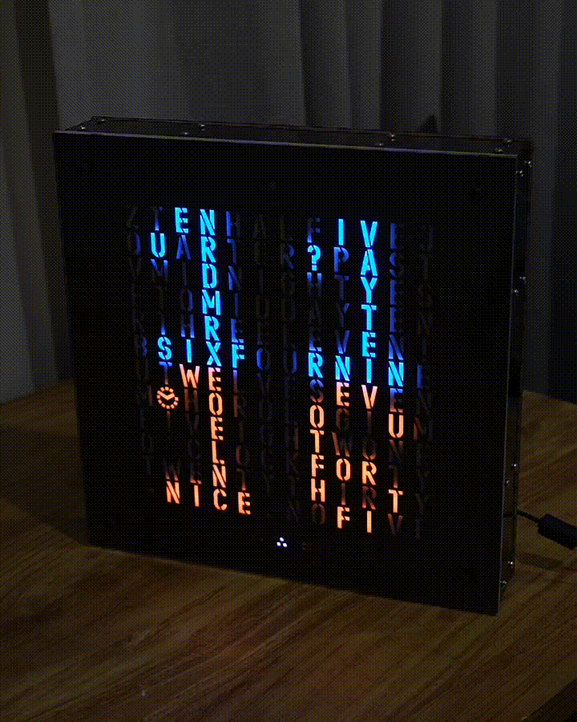
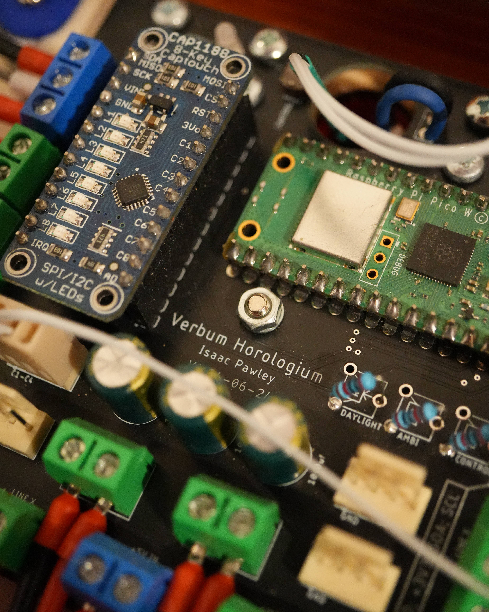
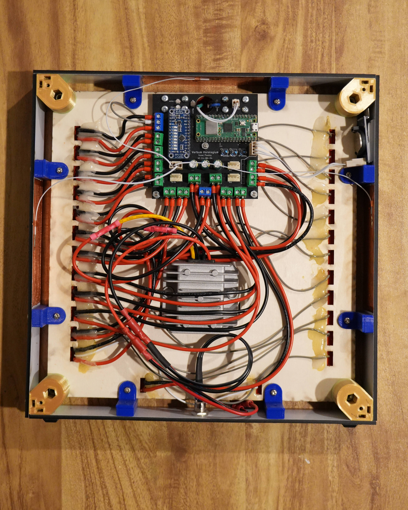
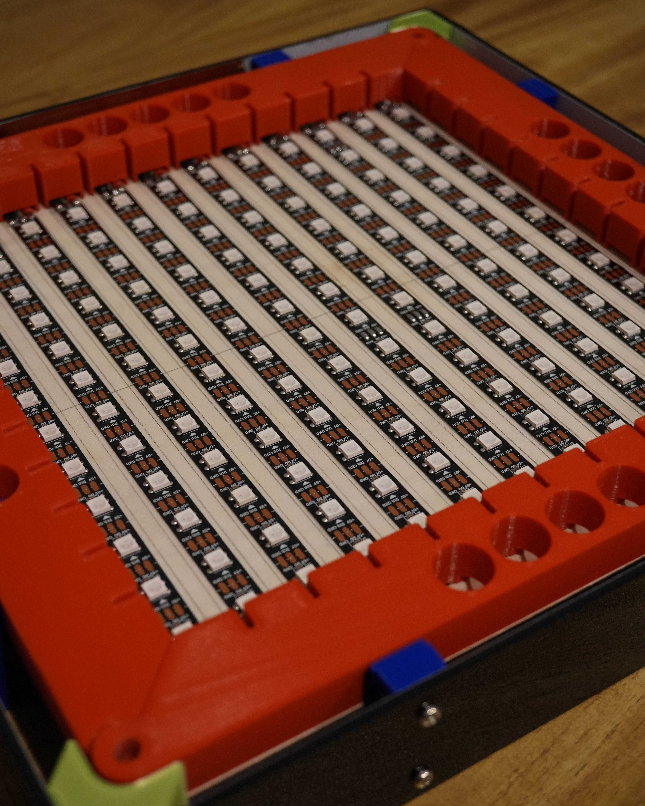

# Verbum Horologium
A digital clock that displays time in an analog fashion.

# Table of Contents
- [Features](#features)
- [Fixes and Updates](#fixes-and-updates)
- [Pictures and Video](#pictures-and-video)
- [Hardware and Setup](#hardware-and-setup)
  - [Laser Cut Housing](#laser-cut-housing)
  - [3D Printed Framing](#3d-printed-framing)
  - [Printed Circuit Board](#printed-circuit-board)
  - [Code](#code)
    - [Dependencies](#dependencies)
- [Copyright and Licensing](#copyright-and-licensing)
- [Contact](#contact)

# Features
- Invisible capacitive touch buttons for user input.
- Automatic brightness control via ambient light sensor.
- Night mode, turning off the display when the room is dark.
- Serial passthrough for updating the real-time clock (RTC).

# Fixes and Updates
> [!IMPORTANT]
> This project is currently under development undergoing a major code refactor. Please bear with me while I work on improving functionality.

# Pictures and Video
<table align="center">
  <tr>
    <td align="center">
       
      <b>Demo</b>
    </td>
  </tr>
</table>
<table align="center">
  <tr>
    <td align="center">
       
      <b>Main control board</b>
    </td>
    <td align="center">
       
      <b>Internal wiring</b>
    </td>
    <td align="center">
       
      <b>LED matrix array</b>
    </td>
  </tr>
</table>

# Hardware and Setup

## Laser Cut Housing
All laser cutting files can be found [here](/assets/laser/).

Please insure that:
- The [LED diffuser](/assets/laser/diffusion_white-acrylic.svg) is cut out of white acrylic.
- The [clock face](/assets/laser/clock-face_black-polypropylene.svg) is cut out of a thin and opaque material.
- The [bottom](/assets/laser/bottom-side_black-acrylic.svg) and [sides](/assets/laser/side_black-acrylic.svg) are cut out of an opaque material.

Doing so will ensure the clock performs at its best.

## 3D Printed Framing
The 3D printed components will not be visible from the front of the clock, so do not worry about surface finish or colour. However, several of the prints will have to be paused throughout the print to insert embedded fasteners.

## Printed Circuit Board
The gerber files for PCB manufacturing can be found [here](/assets/pcb/mainboard_v1_14-06-24.zip).

## Code
### Dependencies
This project requires the following external Arduino libraries, please ensure that they are installed:
- [FastLED (v3.10.3)](https://github.com/FastLED/FastLED/tree/3.10.3)
- [RTClib by Adafruit (v2.1.4)](https://github.com/adafruit/RTClib/tree/2.1.4)
- [CAP1188 Library by Adafruit (v1.1.3)](https://github.com/adafruit/Adafruit_CAP1188_Library/tree/1.1.3)

For programming of the Raspberry Pi Pico W via the Arduino IDE I've included the board library I used here:
- [Arduino Pico by Earle F. Philhower, III (v5.6.0)](https://github.com/earlephilhower/arduino-pico/tree/5.6.0)

Open the Arduino IDE, install the code and board libraries mentioned above, plug in your mainboard, and upload the code.

# Copyright and Licensing
See [license](LICENSE) for in depth info.

This project uses the following third-party libraries:

- FastLED (MIT License)
- RTClib (MIT License)
- Adafruit CAP1188 (BSD License)
- Arduino Pico (LGPL License)

Copyright and license terms belong to their respective authors.

Contact me if anything here is incorrect.

# Contact
If you'd like to get in touch, feel free to reach out!

  
  
  
  

