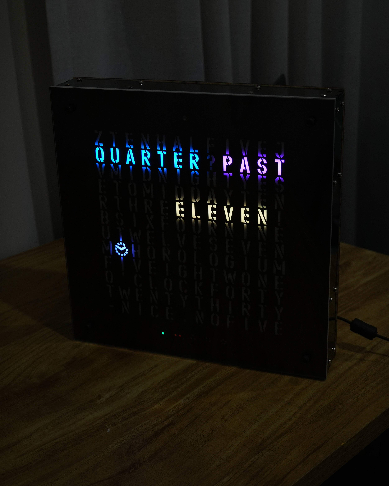
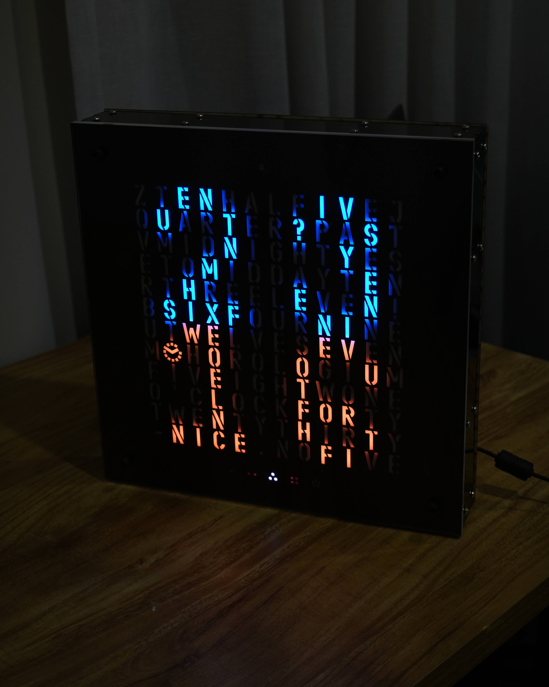

# Verbum Horologium
A digital clock that display time in an analog fashion.

# Table of Contents
- [Features](#features)
- [Fixes and Updates](#fixes-and-updates)
- [Pictures and Video](#pictures-and-video)
- [Hardware and Setup](#hardware-and-setup)
  - [Printed Circuit Board](#printed-circuit-board)
  - [Code](#code)
    - [Dependencies](#dependencies)
- [Copyright and Licencing](#copyright-and-licencing)
- [Contact](#contact)

# Features
- Invisable capivtive touch buttons, for user input.
- Automatic brightness control via ambient light sensor.
- Night mode, turning off the display when the room is dark.
- Serial passthrough for updating the real-time clock (RTC).

# Fixes and Updates
> [!IMPORTANT]
> This project is currently under development undergoing a major code refactor. Please bear with me while I work on improving functionality.

# Pictures and Video
<table align="center">
  <tr>
    <td align="center">
       
      <b>Breif clock demo</b>
    </td>
  </tr>
</table>
<table align="center">
  <tr>
    <td align="center">
       
      <b>Analog time display</b>
    </td>
    <td align="center">
       
      <b>Digital time display</b>
    </td>
  </tr>
</table>
<table align="center">
  <tr>
    <td align="center">
       
      <b>Main control board</b>
    </td>
    <td align="center">
       
      <b>Internal wiring</b>
    </td>
    <td align="center">
       
      <b>LED matrix array</b>
    </td>
  </tr>
</table>

# Hardware and Setup

## Printed Circuit Board
The gerber files for PCB manufacturing can be found [here](/assets/pcb/mainboard_v1_14-06-24.zip). Have them maufactured.

## Code
### Dependencies
This project requires the following external Arduino libraries, please insure that they are installed:
- [FastLED (v3.10.3)](https://github.com/FastLED/FastLED/tree/3.10.3)
- [RTClib by Adafruit (v2.1.4)](https://github.com/adafruit/RTClib/tree/2.1.4)
- [CAP1188 Library by Adafruit (v1.1.3)](https://github.com/adafruit/Adafruit_CAP1188_Library/tree/1.1.3)

For programming of the Raspberry Pi Pico W via the Arduino IDE I've included the board library I used here:
- [Arduino Pico by Earle F. Philhower, III (v5.6.0)](https://github.com/earlephilhower/arduino-pico/tree/5.6.0)

Open the Arduino IDE, install the code and board libraries mentioned above, plug in your mainboard and **Upload** the code.

# Copyright and Licencing

See [licence](LICENSE) for in depth info.

This project uses the following third-party libraries:

- FastLED (MIT License)
- RTClib (MIT License)
- Adafruit CAP1188 (BSD License)
- Arduino Pico (LGPL License)

Copyright and license terms belong to their respective authors.

Contact me should any of this be wrong.

# Contact
If you'd like to get in touch, feel free to reach out!

  
  
  
  

